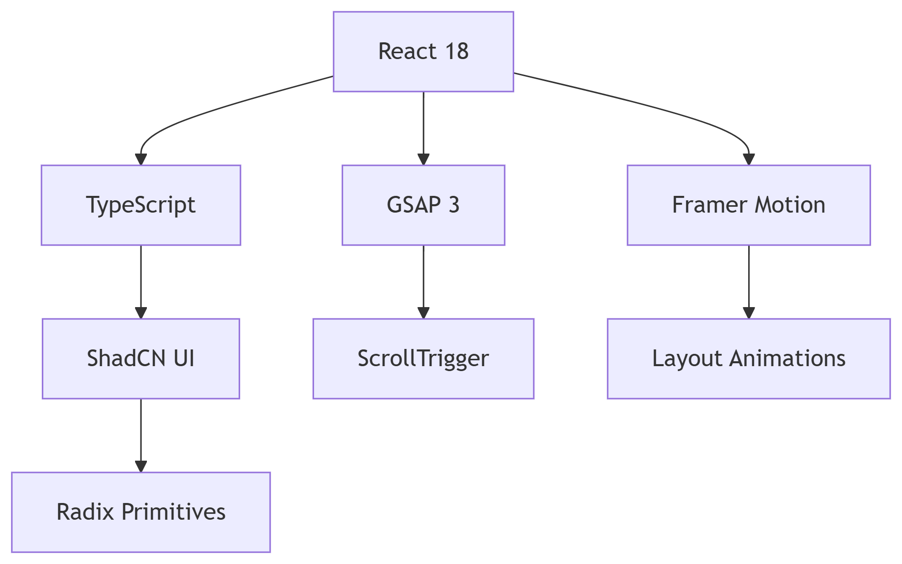
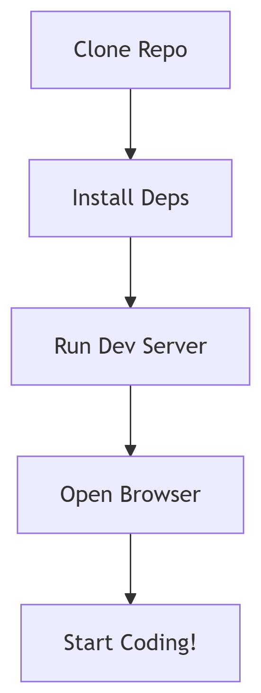
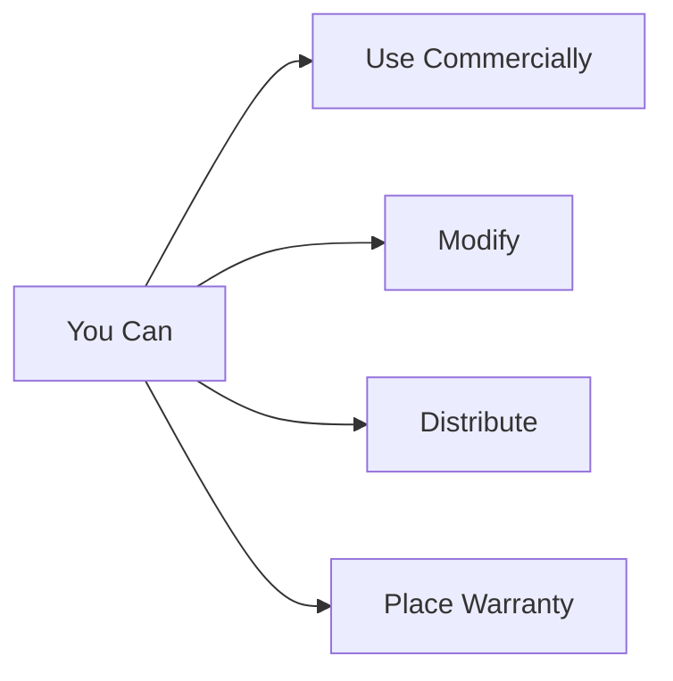
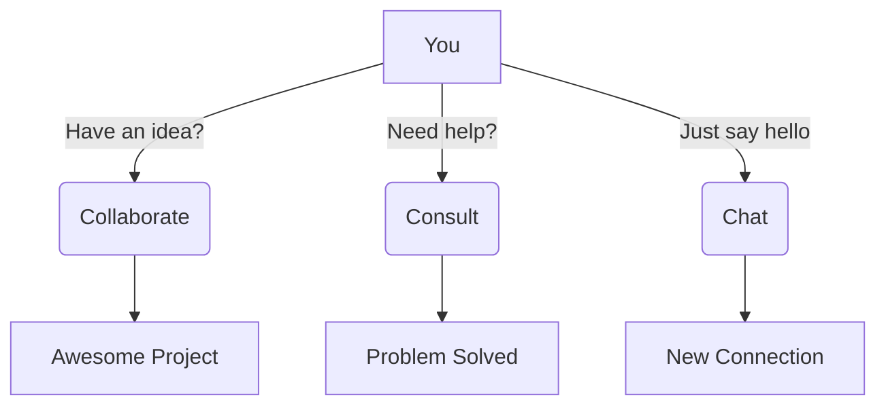

<div align="center">

  <!-- Animated Typing Title -->
  [](https://yourportfolio.link)

  <!-- Animated Tech Badges -->
   
  
  
  

  <!-- Animated Divider -->
  
-
</div>


<div align="center">


 


[](https://github.com/yourusername)

 
  
  
  

</div>

> **A Fully Animated, Next-Level Developer Portfolio — Built with TypeScript, React, GSAP ,Resend & Pure Creativity**
>  


---

## ✨ **Live Demo & Repository** 

<div align="center">

[](https://portfolio-aabidali641s-projects.vercel.app/)
[](https://github.com/aabidali641/Portfolio)

</div>

---

## ✨  **Portfolio Features** 

<div align="center">
  
</div>

### 🏠 **Home & Hero Section**

- **Stunning GSAP & Framer Motion animations**
- **Interactive Buttons:**
  -  → Smooth scroll
  -  → Instant download
  -  → Professional letter
  -  → Global version
 
    
### 🙋 **About Me Section**
- Detailed introduction with a personal touch.
- Animated skill badges & dynamic visuals.
- Story-driven layout for connection with visitors.

### 💼 **Experience Section**
- Interactive timeline using Radix UI components.
- Hover effects & smooth transitions for each role.
- Professional work history presented visually.

### 🚀 **Featured Projects Section**
- Each project card includes:
  - Live Link 🌐
  - Key Features
  - Project Category 🌐
  - Technologies Used
  - GitHub Repository 📂
- Animated hover effects and tilt interaction (`react-parallax-tilt`).
- Carousel view with `embla-carousel-react`.

### 🛠 **Skills & Technologies Section**
- Animated skill icons.
- Categorized tech stack (Frontend, Backend, Tools).
- GSAP stagger animations for logos.

### 📜 **Certifications Section**
- Each certification card includes:
  - Title
  - Issuer
  - **Live Verification Link** 🔗

### 🏆 **Achievements Section**
- Highlighted accomplishments.
- Animated counters and icons.

### 📬 **Get in Touch Section**
- Interactive contact form using **React Hook Form** + **Zod validation**.
- Connected with backend via **Supabase**.

### 🌍 **Follow Me Section**
- GitHub, LinkedIn, Portfolio, Email, LeetCode, Twitter — all with animated icons.
- External links open in new tabs.

### 📌 **Footer Section**
- Minimal yet functional design.
- Quick navigation & copyright.

---
### 🛠 **Tech Stack Showcase**
<div align="center">
  
</div>


| Category | Technologies / Libraries |
|----------|---------------------------|
| **Core** | TypeScript, React, Vite |
| **Animations** | GSAP, Framer Motion, Motion |
| **Styling** | Tailwind CSS, tailwind-merge, tailwindcss-animate |
| **UI Components** | ShadCN, Radix UI (Accordions, Menus, Tooltips, Dialogs, Tabs, etc.) |
| **State & Data** | @tanstack/react-query, Supabase |
| **Forms & Validation** | react-hook-form, @hookform/resolvers, Zod |
| **Navigation** | react-router-dom |
| **Charts** | Recharts |
| **Date Handling** | date-fns |
| **Icons** | lucide-react |
| **Effects & Interactions** | react-parallax-tilt, embla-carousel-react |
| **Theming** | next-themes |
| **Utilities** | clsx, class-variance-authority |


---


### 📂 **Project Folder Structure**

```bash
Portfolio/
├── dist/                      # Build output
├── node_modules/              # Dependencies
├── public/                    # Static assets
│   ├── logo.png               # Site logo
│   ├── placeholder.svg        # Fallback images
│   └── robots.txt             # SEO configuration
│
├── src/                       # Source code
│   ├── assets/                # Media assets
│   │   ├── hero-bg.jpg        # Hero background
│   │   └── pattern-bg.jpg     # UI patterns
│   │
│   ├── components/            # React components
│   │   └── ui/                # UI components
│   │       ├── About.tsx      # About section
│   │       ├── Achivements.tsx # Achievements
│   │       ├── Certifications.tsx # Certifications
│   │       ├── Contact.tsx    # Contact form
│   │       ├── Experience.tsx # Work experience
│   │       ├── FollowMe.tsx   # Social links
│   │       ├── Footer.tsx     # Page footer
│   │       ├── Hero.tsx       # Hero section
│   │       ├── Navigation.tsx # Navbar
│   │       ├── Projects.tsx   # Projects showcase
│   │       └── Skills.tsx     # Skills section
│   │
│   ├── hooks/                 # Custom hooks
│   │   ├── use-mobile.tsx     # Mobile detection
│   │   └── use-toast.ts       # Notification toast
│   │
│   ├── integrations/          # Third-party integrations
│   │   └── supabase/          # Supabase config
│   │       ├── client.ts      # Supabase client
│   │       └── types.ts       # Type definitions
│   │
│   ├── lib/                   # Utilities
│   │   └── utils.ts           # Helper functions
│   │
│   ├── pages/                 # Page components
│   │   ├── Index.tsx          # Main page
│   │   └── NotFound.tsx       # 404 page
│   │
│   ├── supabase/              # Supabase functions
│   │   ├── functions/         # Edge functions
│   │   │   └── send-contact-email/
│   │   │       └── index.ts   # Email handler
│   │   └── migrations/       # Database migrations
│   │
│   ├── App.css                # Global styles
│   ├── App.tsx                # Root component
│   ├── index.css              # Base styles
│   ├── main.tsx               # Entry point
│   └── vite-env.d.ts          # TypeScript types
│
├── .gitignore                # Git exclude rules
├── bun.lockb                 # Bun lockfile
├── components.json           # UI components config
├── eslint.config.js          # ESLint config
├── index.html                # HTML template
├── package.json              # Project manifest
├── package-lock.json         # NPM lockfile
├── postcss.config.js         # PostCSS config
├── README.md                 # Documentation
├── tailwind.config.ts        # Tailwind config
├── tsconfig.app.json         # TS config (app)
├── tsconfig.json             # TS base config
└── tsconfig.node.json        # TS config (Node)

```

### **📜 Getting Started** 
<div align="center">
  
[](https://github.com/aabidali641/Portfolio)

</div>

### 🛠 **Setup Guide**
```bash
# 1️⃣ Clone the repository
git clone https://github.com/aabidali641/Portfolio.git

# 2️⃣ Navigate to project folder
cd Portfolio

# 3️⃣ Install dependencies
npm install

# 4️⃣ Start development server
npm run dev


```
### **✨ Work Flow For Getting Started**

<div align="center">
  
</div>

### **✨ Project Scripts** 

<div align="center">
  
[](https://npmjs.com)

</div>


### 🚀 **Command Palette**
```bash
# Interactive terminal (try these commands)

$ npm run [TAB]                        # Shows all available commands
$ npm run dev                          # 🟢 Starts Vite dev server (localhost:5173)
$ npm run build                        # 🏗️  Creates optimized production build
$ npm run build:dev                    # 🔧 Development mode build
$ npm run lint                         # 🔍 Runs ESLint with prettier
$ npm run preview                      # 👀 Launches production preview
$ npm test                             # 🧪 Run tests (if configured)

# Pro tip: Add --verbose for detailed logging
$ npm run build --verbose

```

### **🙋Deployment Guide** 

<div align="center">
  
[](https://vitejs.dev)

</div>

### 🚀 **Deployment Targets**
<div align="center">

| Platform | Badge | Command |
|----------|-------|---------|
| [Vercel](https://vercel.com) | [](https://vercel.com/new/clone?repository-url=https://github.com/aabidali641/Portfolio) | `vercel --prod` |
| [Netlify](https://netlify.com) | [](https://app.netlify.com/start/deploy?repository=https://github.com/aabidali641/Portfolio) | `netlify deploy` |
| [Cloudflare](https://pages.cloudflare.com) | [](https://dash.cloudflare.com/?to=/:account/pages) | `npm run build` |
| [GitHub Pages](https://pages.github.com) | [](https://github.com/aabidali641/Portfolio/deployments) | `gh-pages -d dist` |

</div>

### ⚡ **Vite Optimizations**
```bash
# Build with analysis (see bundle breakdown)
$ npm run build -- --profile

# Preview build locally before deploying
$ npm run preview

```
##  **License** 

<div align="center">

[](https://opensource.org/licenses/MIT)

</div>


<div align="center">

[](https://github.com/aabidali641/Portfolio/blob/main/LICENSE)
[](https://app.fossa.com/projects/git%2Bgithub.com%2Faabidali641%2FPortfolio)
[](https://github.com/aabidali641/Portfolio/blob/main/CODE_OF_CONDUCT.md)

</div>

### 🌟 **Permissions**


##  **Let's Connect!** 

<div align="center">

[](https://github.com/aabidali641)

</div>

### 🌐 **Digital Handshake**
<div align="center" style="display: flex; flex-wrap: wrap; gap: 10px; justify-content: center;">

[](mailto:mdaabidali28@gmail.com)
[](https://linkedin.com/in/aabidali641)
[](https://github.com/aabidali641)
[](https://x.com/641Aabid)
[](https://portfolio-aabidali641s-projects.vercel.app/)
[](https://leetcode.com/u/aabidAli/)

</div>

### 💬 **Let's Talk Tech**


##  **Crafted With** 

<div align="center">

[](https://github.com/aabidali641/Portfolio)

</div>

### ✨ **Tech Heartbeat**
```mermaid
pie
    title Development DNA
    "TypeScript" : 35
    "Creativity" : 30
    "Passion" : 25
    "Coffee" : 10
