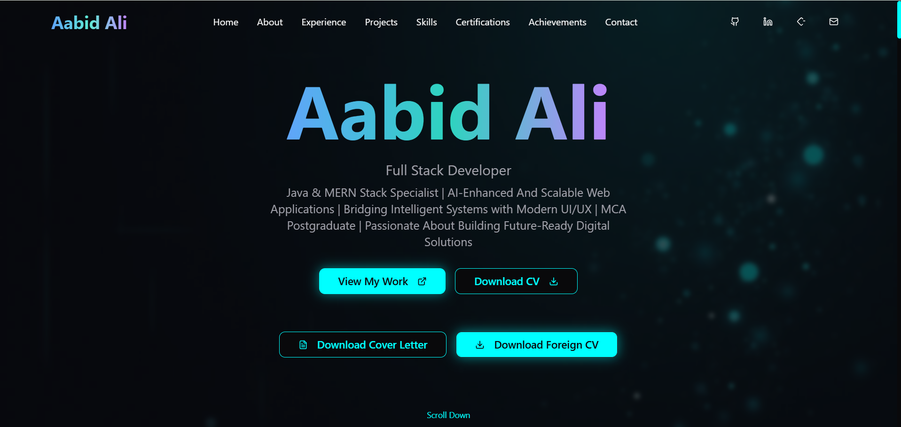

  <!-- Animated Typing Title -->
  

  <!-- Animated Tech Badges -->
   
  
  
  

  <!-- Animated Divider -->
  

 

 
  
  
  

> **A Fully Animated, Next-Level Developer Portfolio — Built with TypeScript, React, GSAP ,Resend & Pure Creativity**
>  

---

## 📌 Live Demo & Repository
🔗 **Live Portfolio:** [View Here]()  
💻 **GitHub Repo:** [View Code](https://github.com/your-username/your-repo-name)

---

## ✨ Features

This portfolio is not just a website — it’s an **interactive experience** ⚡ powered by cutting-edge animations and modern UI principles.

### 🏠 **Home & Hero Section**
- Stunning GSAP & Framer Motion animations.
- **Buttons:**
  - `View My Work` → Smooth scroll to featured projects.
  - `Download CV` → Instant download of your professional CV.
  - `Download Cover Letter` → Instant download of your personalized cover letter.
  - `Download Foreign CV` → Tailored CV for global opportunities.
- Eye-catching text animations & parallax effects.

### 🙋 **About Me**
- Detailed introduction with a personal touch.
- Animated skill badges & dynamic visuals.
- Story-driven layout for connection with visitors.

### 💼 **Experience**
- Interactive timeline using Radix UI components.
- Hover effects & smooth transitions for each role.
- Professional work history presented visually.

### 🚀 **Featured Projects**
- Each project card includes:
  - Live Link 🌐
  - GitHub Repository 📂
- Animated hover effects and tilt interaction (`react-parallax-tilt`).
- Carousel view with `embla-carousel-react`.

### 🛠 **Skills & Technologies**
- Animated skill icons.
- Categorized tech stack (Frontend, Backend, Tools).
- GSAP stagger animations for logos.

### 📜 **Certifications**
- Each certification card includes:
  - Title
  - Issuer
  - **Live Verification Link** 🔗

### 🏆 **Achievements**
- Highlighted accomplishments.
- Animated counters and icons.

### 📬 **Get in Touch**
- Interactive contact form using **React Hook Form** + **Zod validation**.
- Connected with backend via **Supabase**.

### 🌍 **Follow Me**
- GitHub, LinkedIn, Portfolio, Email, LeetCode, Twitter — all with animated icons.
- External links open in new tabs.

### 📌 **Footer**
- Minimal yet functional design.
- Quick navigation & copyright.

---

## 🛠 Tech Stack & Tools

| Category | Technologies / Libraries |
|----------|---------------------------|
| **Core** | TypeScript, React, Vite |
| **Animations** | GSAP, Framer Motion, Motion |
| **Styling** | Tailwind CSS, tailwind-merge, tailwindcss-animate |
| **UI Components** | ShadCN, Radix UI (Accordions, Menus, Tooltips, Dialogs, Tabs, etc.) |
| **State & Data** | @tanstack/react-query, Supabase |
| **Forms & Validation** | react-hook-form, @hookform/resolvers, Zod |
| **Navigation** | react-router-dom |
| **Charts** | Recharts |
| **Date Handling** | date-fns |
| **Icons** | lucide-react |
| **Effects & Interactions** | react-parallax-tilt, embla-carousel-react |
| **Theming** | next-themes |
| **Utilities** | clsx, class-variance-authority |

---

## 📂 Project Structure
